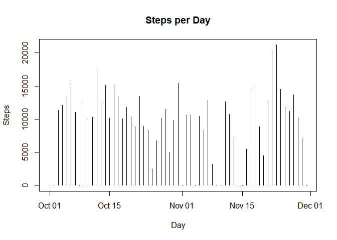
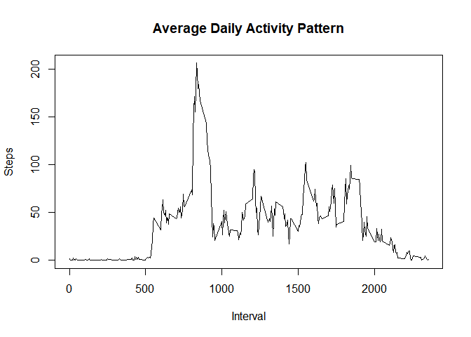
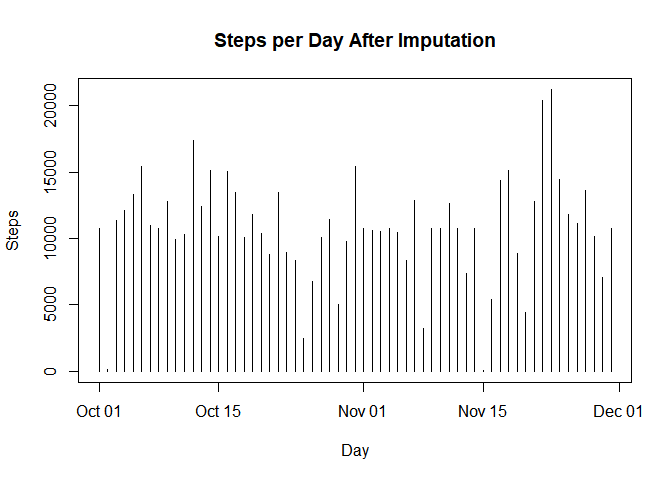

# Reproducible Research: Peer Assessment 1
Sever Fundatureanu  


## Loading and preprocessing the data


First unzip the archive, load the data and convert the date column to type Date.

```r
unzip("activity.zip")
rawData <- read.csv("activity.csv", header=TRUE)
rawData$date <- as.Date(rawData$date)
```

## What is mean total number of steps taken per day?

First, we compute total number of steps per day:


```r
require(dplyr, quietly=TRUE, warn.conflicts = FALSE)
perDaySum <- rawData %>% group_by(date) %>% summarise(steps=sum(steps, na.rm=TRUE))
```

We then show a histogram of steps per day:

```r
plot(perDaySum$date, perDaySum$steps, type="h",
     main="Steps per Day", xlab="Day", ylab="Steps")
```

<!-- -->

We notice some days have missing values. Next, we compute median and mean steps per day:

```r
dailyMean <- mean(perDaySum$steps)
dailyMedian <- median(perDaySum$steps)
```
The mean is 9354.23 and median is 10395.

## What is the average daily activity pattern?

We compute the average number of steps across all days for each 5-minute interval and plot a time-series to see the daily activity pattern:

```r
perIntervalMean <- rawData %>% group_by(interval) %>% summarise(steps=mean(steps, na.rm=TRUE))
with(perIntervalMean, plot(interval, steps, type="l", main="Average Daily Activity Pattern", xlab="Interval", ylab="Steps"))
```

<!-- -->

We also show the 5-minute interval which contains the maximum number of steps:

```r
perIntervalMean[perIntervalMean$steps==max(perIntervalMean$steps),]$interval
```

```
## [1] 835
```

## Imputing missing values

We check how many missing values we have:

```r
colSums(is.na(rawData))
```

```
##    steps     date interval 
##     2304        0        0
```
We have 2304 missing values in the steps column.
We check how the missing values are spread over days:

```r
missingSubset <- rawData[is.na(rawData$steps),]
table(missingSubset$date)
```

```
## 
## 2012-10-01 2012-10-08 2012-11-01 2012-11-04 2012-11-09 2012-11-10 
##        288        288        288        288        288        288 
## 2012-11-14 2012-11-30 
##        288        288
```
We have 8 days which do not have any data (one day has 288 rows total). We impute the rows for each missing day by using the average for each 5-minute interval. We create a new data frame *newData* with the valid data. 

```r
newData<-as.data.frame(rawData)
missingDates<-unique(missingSubset$date)
for (d in missingDates) {
    newData[newData$date==d,]$steps <- perIntervalMean$steps
}
sum(is.na(newData$steps))
```

```
## [1] 0
```

Next, we use the new data frame to recompute total number of steps per day and plot the histogram. We see all days now have valid values.

```r
newPerDaySum <- newData %>% group_by(date) %>% summarise(steps=sum(steps, na.rm=TRUE))
plot(newPerDaySum$date, newPerDaySum$steps, type="h",
     main="Steps per Day After Imputation", xlab="Day", ylab="Steps")
```

<!-- -->

We also recompute median and mean steps per day:

```r
round(mean(newPerDaySum$steps), 2)
```

```
## [1] 10766.19
```

```r
round(median(newPerDaySum$steps), 2)
```

```
## [1] 10766.19
```
They are both well above the original values, which makes sense since the original data used 0s for the missing days. We also notice the mean and median are now the same, so the data is not skewed.

## Are there differences in activity patterns between weekdays and weekends?

We first add a new factor variable *isWeekend* with 2 levels "weekend" and "weekday":

```r
weekDays <- weekdays(newData$date)
weekendEncode <- ifelse(weekDays %in% c("Saturday", "Sunday"), "weekend", "weekday")
newData <- cbind(newData, isWeekend=as.factor(weekendEncode))
```

Compute average steps per 5-minute interval for weekend and weekday, then plot:

```r
require(lattice, quietly = TRUE)
perWeekdayIntervalMean <- newData %>% group_by(interval, isWeekend) %>% summarise(steps=mean(steps))
xyplot(steps ~ interval | isWeekend, data=perWeekdayIntervalMean, layout=c(1,2), type="l")
```

<!-- -->

The activity patterns do have slight differences between weekend vs. weekday. Weekdays show spikes at the beginning and end of the day, whereas in the weekend there is an overall smoother trend. The maximum spike is above 200 during weekdays, which could indicate some kind of sport activity in the morning. During the weekday mid-day, activity level is low ~50 steps, indicating a type of static office-like work style. In the weekends, the values vary mostly between 50 and 150 steps across the whole day, so more activity than weekdays.  


